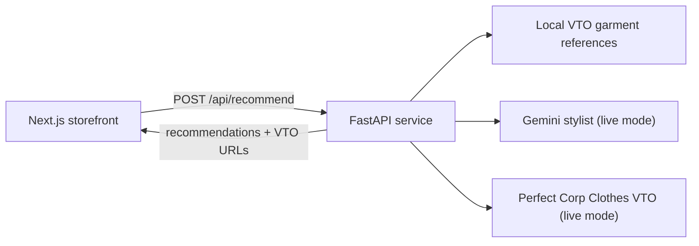

# Shop with Confidence

An AI-assisted fashion storefront that helps shoppers choose an occasion-appropriate look, preview it on their own photo, and buy with more confidence.

## Problem and solution

Online shoppers cannot easily tell whether an outfit will suit their occasion or how it will look on them. Shop with Confidence combines a curated catalogue, an AI stylist, and full-body virtual try-on (VTO) to turn a photo and occasion into a concise, explained edit.

## Features

- Responsive storefront for new arrivals, men, women, and accessories.
- Photo upload with client-side image-type selection and accessible error/loading feedback.
- Occasion and style-profile selection.
- Three AI-generated recommendations with confidence context.
- Full-body VTO for each recommendation and a complete-the-look footwear VTO.
- Same-origin `/api/*` routing in Vercel; frontend routes such as `/upload` remain client pages.
- Deterministic mock mode for demos without provider credentials.

## Architecture



The root Vercel configuration defines two route-prefixed services. The Next.js frontend handles `/`, including Next.js App Router, RSC, and `/_next/*` requests. The FastAPI backend is exposed only under `/api/*`; this prevents a browser request to `/upload` from being routed to a POST-only backend endpoint.

## User flow

1. Open the landing page and select **Meet the AI Stylist**.
2. Upload a clear full-body JPEG, PNG, or WebP photo; select occasion and style profile.
3. The browser posts the photo and preferences to `/api/recommend`.
4. The backend ranks catalogue garments and creates VTO previews.
5. The recommendations page displays three looks and can generate the footwear finishing step through `/api/tryon`.

## Stack and integrations

- Frontend: Next.js 16, React 19, TypeScript, Tailwind CSS.
- Backend: FastAPI, Pydantic, HTTPX.
- AI: Google Gemini (optional live stylist mode).
- VTO: Perfect Corp / YouCam Clothes VTO (optional live mode).
- Hosting: Vercel Services (Next.js + FastAPI in one project).

## Repository layout

```text
frontend/       Next.js application and project-owned catalogue imagery
backend/        FastAPI API, orchestration, and backend garment references
backend/tests/  Automated API and service tests
docs/           Setup, deployment, API, architecture, and security notes
vercel.json     Same-origin service routing
```

## Local setup

```powershell
Copy-Item .env.example backend/.env
cd frontend; npm ci
cd ..\backend; python -m venv .venv; .\.venv\Scripts\Activate.ps1; pip install -r requirements.txt
cd ..; vercel dev -L
```

`vercel dev -L` runs both route-prefixed services together, matching production. To work on an individual service, run `npm run dev` in `frontend` or `uvicorn main:app --reload --port 8000` in `backend`.

## Environment variables

Copy `.env.example`; it documents every supported variable. Leave `AI_MODE=mock` for a reliable no-credential demo. Set `AI_MODE=live`, `GEMINI_API_KEY`, `YOUCAM_API_KEY`, and `YOUCAM_CLOTHES_TRYON_URL` only in your provider/Vercel secret stores. Never commit a real `.env` file.

## Deployment

See [docs/DEPLOYMENT.md](docs/DEPLOYMENT.md). The Vercel project must use the **Services** framework because `vercel.json` declares a Next.js and FastAPI service.

## Validation

```powershell
cd frontend; npm run lint; npm run build
cd ..\backend; python -m pytest tests
```

## Accessibility and privacy

The storefront uses semantic controls, visible keyboard focus, form labels/accessible names, meaningful product/image text, and live error messages. Uploaded images are sent only to the configured AI/VTO providers when live mode is enabled; avoid logging image contents or provider credentials. This repository makes no compliance certification claim.

## Limitations and next steps

Live VTO requires valid provider credentials and provider-supported images; provider latency can affect the experience. Future work includes persistent, consent-aware upload storage, server-side rate limiting, analytics with privacy controls, and broader automated browser coverage.
